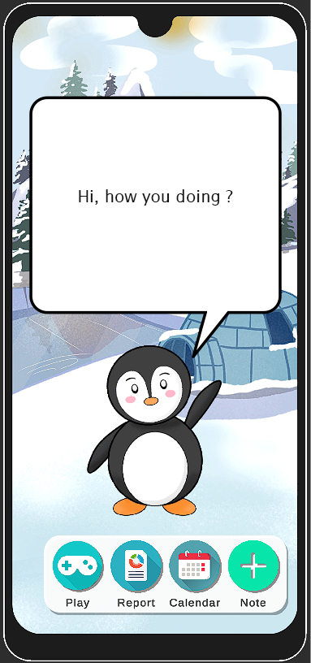

# APPLICATION TO HELP RELIEF AND REFLECT ANGER

## My senior project


<!-- TABLE OF CONTENTS -->
## Table of Contents
1. [About The Project](#about-the-project)
2. [Installation](#installation)
3. [Directory Tree](#directory-tree)

<!-- ABOUT THE PROJECT -->
## About The Project
**APPLICATION TO HELP RELIEF AND REFLECT ANGER** or **PenguinApp** is the mobile application aims for helping user relief and reflect their anger for a better mental health.

## Installation
Using [Unity 2020.x LTS](https://unity3d.com/get-unity/download/archive) release for development and demo.

### Steps
1. Download and extract project from 
   ```
   /63-2_CS402_24_yao-r1/src/PenguinApp.zip
   ```
2. Download [Unity Hub](https://unity3d.com/get-unity/download)
3. Install **Unity 2020.x LTS** via Unity Hub
4. Add **PenguinApp** extracted from step 1. to Unity Hub
5. Select Unity Version - 2020.x then launch the project
